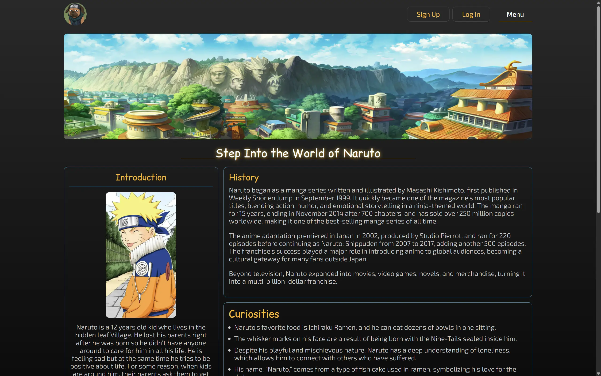

## Shinobi Archives Intro

This is a solo project based on the popular anime called Naruto. The site helps people have an extensive amount of characters, if not all, and look at their individual information when a card is clicked. Right now, the only available endpoint that's available for cards is the **CHARACTERS** section which can be found in the **Menu** options in the Main page in which, we have an introduction to who Naruto is and a little bit of interesting info as well as the stats for how many cards are available in every endpoint/link.

## Technologies

At the moment, this project is using the most popular framework, **REACT**, which allows the page to be an 'SPA' or Single Page Application that makes it faster due to only load what's being requested by the user depending on interaction and allows the programmer to interact with **CSS, HTML, AND JAVASCRIPT** in the best possible way. I'm also using the **ESLINT** dependency to prevent mistakes in the code.

## Best Practices

The project is using **imports** as much as possible to keep things separated and organized for scalability and future changes. The **BEM methodology** is being used across the project because I find is more readable and better to understand. Images are **compressed** to avoid lags/low performance on user experience. The page is compatible with any **screen sizes** to reach a bigger audience.

## LINK TO PAGE

The deployment of this project is through GitHub: [Shinobi Archives – GitHub Pages](https://obito2912.github.io/shinobiarchives/)

## Run locally

```bash
git clone https://github.com/obito2912/shinobiarchives.git
cd shinobiarchives
npm install
npm run dev
```

## SCREENSHOTS


